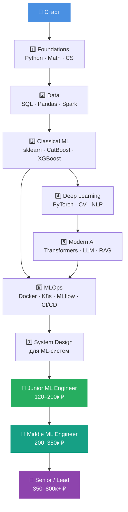
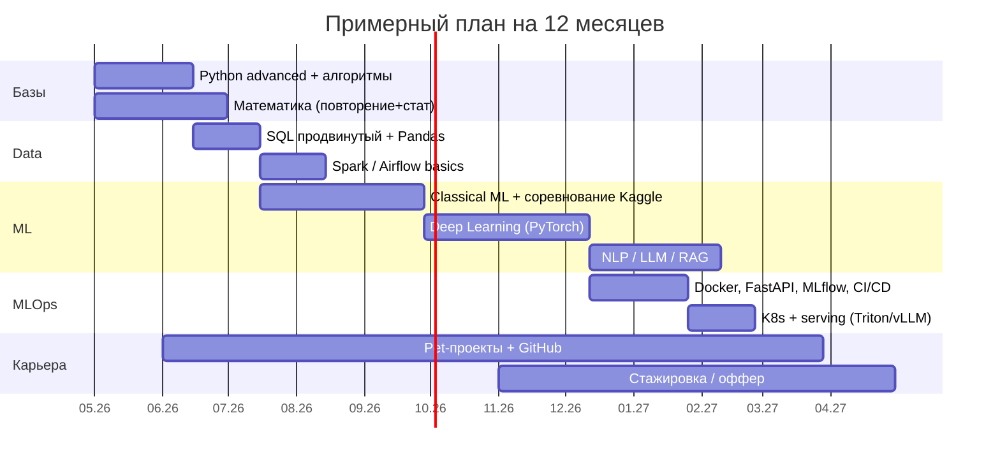

# 🤖 ML Engineer Roadmap 2026

### Дорожная карта до Senior ML Engineer на российском рынке

---

## 📍 О роудмапе

> **Отправная точка:** базовые знания программирования и/или Data Engineering, понимание основ математики.
> **Цель:** стать перспективным и хорошо оплачиваемым **ML Engineer** на российском рынке (Yandex, Sber, T-Bank, Avito, VK, Ozon, Wildberries, MTS AI и т.д.).
> **Горизонт:** 12–18 месяцев активной работы до уверенного Middle.

---

## 🗺️ Карта пути

---

## 📚 Этапы

| № | Раздел | Длительность | Файл |
|---|--------|:---:|------|
| 1 | 🐍 **Foundations** — Python, алгоритмы, CS | 1–2 мес | [01_foundations.md](docs/01_foundations.md) |
| 2 | 📐 **Математика для ML** | параллельно | [02_math.md](docs/02_math.md) |
| 3 | 🗄️ **Data Engineering для ML** | 1–2 мес | [03_data.md](docs/03_data.md) |
| 4 | 🤖 **Classical ML** | 2–3 мес | [04_classical_ml.md](docs/04_classical_ml.md) |
| 5 | 🧠 **Deep Learning** | 2–3 мес | [05_deep_learning.md](docs/05_deep_learning.md) |
| 6 | 💬 **NLP, CV, LLM** | 2–3 мес | [06_modern_ai.md](docs/06_modern_ai.md) |
| 7 | ⚙️ **MLOps & Production** | 2 мес | [07_mlops.md](docs/07_mlops.md) |
| 8 | 🏗️ **ML System Design** | 1 мес | [08_system_design.md](docs/08_system_design.md) |
| 9 | 💼 **Карьера на рынке РФ** | continuous | [09_career_ru.md](docs/09_career_ru.md) |
| 10 | 🎯 **Pet-проекты и портфолио** | continuous | [10_projects.md](docs/10_projects.md) |
| 11 | 📖 **Ресурсы (RU)** | — | [11_resources_ru.md](docs/11_resources_ru.md) |

---

## 🎯 Примерный план

---

## 💰 Зарплатные ориентиры (РФ, 2026)

| Грейд | Опыт | Москва (₽/мес, gross) | Регионы |
|---|:---:|:---:|:---:|
| 👶 Intern / Trainee | 0 | 60–120k | 40–80k |
| 🚀 Junior | 0–1 год | 120–200k | 90–150k |
| ⚡ Middle | 2–3 года | 200–350k | 150–280k |
| 🔥 Senior | 4–6 лет | 350–600k | 250–450k |
| 👑 Lead / Staff | 6+ лет | 600k–1M+ | 400–700k |

> Источники: hh.ru, getmatch, habr career, Хабр зарплаты, ODS-чаты. Цифры зависят от компании, грейдинга и стека (LLM/CV платят выше среднего).

---

## 🏢 Кто нанимает ML Engineer в РФ

| 🥇 Tier-1 (FAANG-уровень РФ) | 🥈 Tier-2 (сильный ML) | 🥉 Tier-3 (растут) |
|:---:|:---:|:---:|
| Yandex (Поиск, Алиса, Шедеврум) | Avito | Wildberries |
| Sber / SberAI (GigaChat, Kandinsky) | Ozon | X5 Tech |
| T-Bank (ex-Tinkoff) | МТС AI / MWS | Альфа-Банк |
| VK (VK Tech, Маруся) | Kaspersky | Газпромбанк Tech |
| | Skoltech / AIRI | ВТБ, Совкомбанк |

---

## ✅ Чек-лист готовности к собеседованиям

- [ ] Python: ООП, асинхронность, типизация, тесты (`pytest`)
- [ ] Алгоритмы: LeetCode Easy/Medium ~150 задач
- [ ] SQL: оконные функции, оптимизация, EXPLAIN
- [ ] Математика: линал, мат.анализ, теорвер, статистика
- [ ] Classical ML: умею объяснить bias/variance, регуляризацию, бустинги «изнутри»
- [ ] Deep Learning: своими руками реализовал backprop, CNN, Transformer
- [ ] PyTorch: пишу train loop без копипаста
- [ ] LLM: знаю про attention, KV-cache, RAG, fine-tuning (LoRA)
- [ ] MLOps: задеплоил модель в Docker + FastAPI + мониторинг
- [ ] System Design: разобрал 3+ кейса (рекомендации, поиск, фрод, NLP-сервис)
- [ ] Портфолио: 2–3 сильных pet-проекта на GitHub
- [ ] Kaggle: 1+ соревнование с Bronze+ медалью
- [ ] Резюме на hh + getmatch + habr career

---

## 🧭 Как пользоваться репозиторием

1. Идите по разделам **по порядку**, но математику и алгоритмы — **параллельно**.
2. Каждую тему закрепляйте **проектом** (см. [10_projects.md](docs/10_projects.md)).
3. Раз в 2 недели — **review прогресса** и обновление [PROGRESS.md](PROGRESS.md).
4. Все ресурсы в [11_resources_ru.md](docs/11_resources_ru.md) — преимущественно русскоязычные и бесплатные.

---

### ⭐ Если роудмап полезен — поставь звезду

**Made for myself by myself · 2026**

