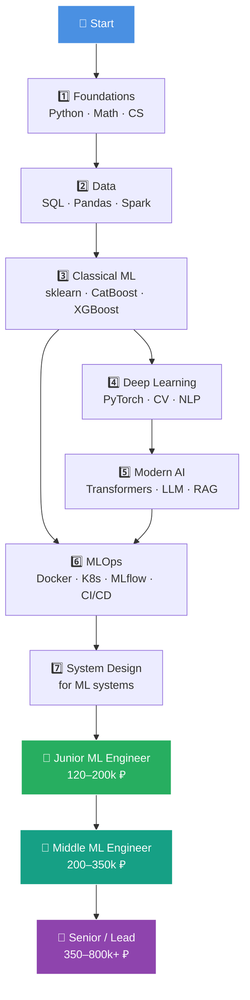
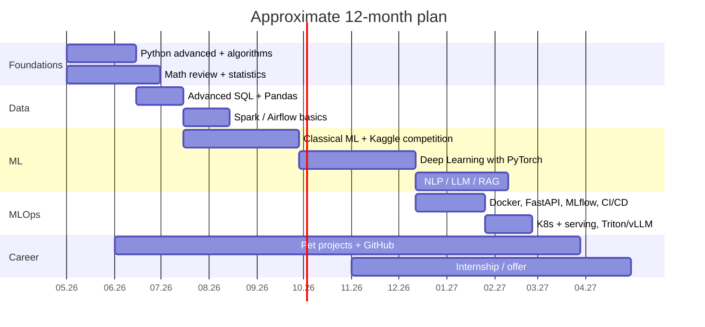

# 🤖 ML Engineer Roadmap 2026

### Roadmap to Senior ML Engineer in the Russian market

[Русская версия](docs/ru/01_foundations.md) · [English version](docs/en/01_foundations.md)

---

## 📍 About the roadmap

Materials for getting an ML Engineer offer.

---

## 🗺️ Roadmap

---

## 📚 Stages

| # | Section | Duration | EN | RU |
|---|---|:---:|---|---|
| 1 | 🐍 **Foundations** — Python, algorithms, CS | 1–2 months | [en](docs/en/01_foundations.md) | [ru](docs/ru/01_foundations.md) |
| 2 | 📐 **Math for ML** | in parallel | [en](docs/en/02_math.md) | [ru](docs/ru/02_math.md) |
| 3 | 🗄️ **Data Engineering for ML** | 1–2 months | [en](docs/en/03_data.md) | [ru](docs/ru/03_data.md) |
| 4 | 🤖 **Classical ML** | 2–3 months | [en](docs/en/04_classical_ml.md) | [ru](docs/ru/04_classical_ml.md) |
| 5 | 🧠 **Deep Learning** | 2–3 months | [en](docs/en/05_deep_learning.md) | [ru](docs/ru/05_deep_learning.md) |
| 6 | 💬 **NLP, CV, LLM** | 2–3 months | [en](docs/en/06_modern_ai.md) | [ru](docs/ru/06_modern_ai.md) |
| 7 | ⚙️ **MLOps & Production** | 2 months | [en](docs/en/07_mlops.md) | [ru](docs/ru/07_mlops.md) |
| 8 | 🏗️ **ML System Design** | 1 month | [en](docs/en/08_system_design.md) | [ru](docs/ru/08_system_design.md) |
| 9 | 💼 **Career in the Russian market** | continuous | [en](docs/en/09_career.md) | [ru](docs/ru/09_career.md) |
| 10 | 🎯 **Pet projects and portfolio** | continuous | [en](docs/en/10_projects.md) | [ru](docs/ru/10_projects.md) |
| 11 | 📖 **Resources** | — | [en](docs/en/11_resources.md) | [ru](docs/ru/11_resources.md) |

---

## 🎯 Approximate plan

---

## 💰 Salary benchmarks, Russia 2026

| Grade | Experience | Moscow, gross / month | Regions |
|---|:---:|:---:|:---:|
| 👶 Intern / Trainee | 0 | 60–120k ₽ | 40–80k ₽ |
| 🚀 Junior | 0–1 year | 120–200k ₽ | 90–150k ₽ |
| ⚡ Middle | 2–3 years | 200–350k ₽ | 150–280k ₽ |
| 🔥 Senior | 4–6 years | 350–600k ₽ | 250–450k ₽ |
| 👑 Lead / Staff | 6+ years | 600k–1M+ ₽ | 400–700k ₽ |

> Sources: hh.ru, getmatch, Habr Career, Habr salary reports, ODS chats. Numbers depend on company, grade, and stack; LLM/CV roles usually pay above average.

---

## 🏢 Who hires ML Engineers in Russia

| 🥇 Tier-1 | 🥈 Tier-2 | 🥉 Tier-3 |
|:---:|:---:|:---:|
| Yandex (Search, Alice, Shedevrum) | Avito | Wildberries |
| Sber / SberAI (GigaChat, Kandinsky) | Ozon | X5 Tech |
| T-Bank | MTS AI / MWS | Alfa-Bank |
| VK (VK Tech, Marusia) | Kaspersky | Gazprombank Tech |
| | Skoltech / AIRI | VTB, Sovcombank |

---

## ✅ Interview readiness checklist

- [ ] Python: OOP, async, typing, tests (`pytest`)
- [ ] Algorithms: ~150 LeetCode Easy/Medium problems
- [ ] SQL: window functions, optimization, EXPLAIN
- [ ] Math: linear algebra, calculus, probability, statistics
- [ ] Classical ML: explain bias/variance, regularization, boosting internals
- [ ] Deep Learning: implemented backprop, CNN, Transformer by hand
- [ ] PyTorch: can write a train loop without copy-paste
- [ ] LLM: attention, KV-cache, RAG, fine-tuning (LoRA)
- [ ] MLOps: deployed a model with Docker + FastAPI + monitoring
- [ ] System Design: studied 3+ cases: recommendations, search, fraud, NLP service
- [ ] Portfolio: 2–3 strong pet projects on GitHub
- [ ] Kaggle: 1+ competition with a Bronze+ medal
- [ ] Resume on hh + getmatch + Habr Career

---

## 🧭 How to use this repository

1. Go through sections **in order**, but study math and algorithms **in parallel**.
2. Reinforce every topic with a **project**; see [10_projects.md](docs/en/10_projects.md).
3. Every 2 weeks, review progress and update [PROGRESS.md](PROGRESS.md).
4. Most resources are Russian-language and practical for the Russian market.

---

### ⭐ If this roadmap is useful, give it a star

**Made for learning and portfolio building · 2026**

