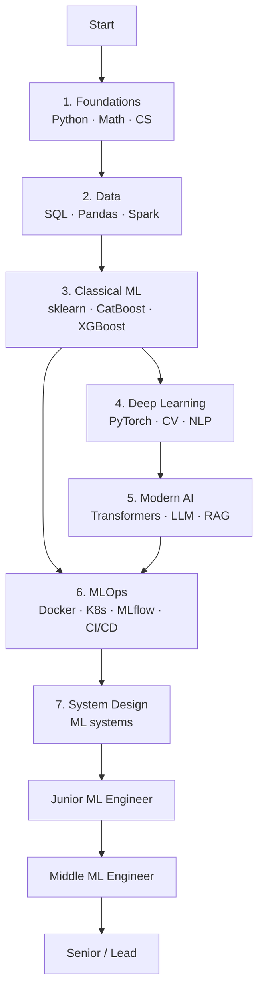

# ML Engineer Roadmap 2026

Roadmap from fundamentals to Senior ML Engineer, adapted for the Russian market.

[Русская версия](docs/ru/01_foundations.md) · [English version](docs/en/01_foundations.md)

---

## About

This repository is a practical ML Engineer roadmap: Python, math, data engineering, classical ML, deep learning, LLM/RAG, MLOps, system design, career prep, and portfolio projects.

Здесь публикованы материалы для получения оффера на ML Engineer.

The content is split into two language versions:

- [docs/ru](docs/ru) - original Russian version.
- [docs/en](docs/en) - adapted English version.

---

## Roadmap

---

## Sections

| # | Topic | RU | EN |
|---|---|---|---|
| 1 | Foundations: Python, algorithms, CS | [ru](docs/ru/01_foundations.md) | [en](docs/en/01_foundations.md) |
| 2 | Math for ML | [ru](docs/ru/02_math.md) | [en](docs/en/02_math.md) |
| 3 | Data Engineering for ML | [ru](docs/ru/03_data.md) | [en](docs/en/03_data.md) |
| 4 | Classical ML | [ru](docs/ru/04_classical_ml.md) | [en](docs/en/04_classical_ml.md) |
| 5 | Deep Learning | [ru](docs/ru/05_deep_learning.md) | [en](docs/en/05_deep_learning.md) |
| 6 | Modern AI: NLP, LLM, RAG | [ru](docs/ru/06_modern_ai.md) | [en](docs/en/06_modern_ai.md) |
| 7 | MLOps & Production | [ru](docs/ru/07_mlops.md) | [en](docs/en/07_mlops.md) |
| 8 | ML System Design | [ru](docs/ru/08_system_design.md) | [en](docs/en/08_system_design.md) |
| 9 | Career | [ru](docs/ru/09_career.md) | [en](docs/en/09_career.md) |
| 10 | Projects and portfolio | [ru](docs/ru/10_projects.md) | [en](docs/en/10_projects.md) |
| 11 | Resources | [ru](docs/ru/11_resources.md) | [en](docs/en/11_resources.md) |

---

## Suggested pace

- 12-18 months of active work to confident Middle level.
- Math and algorithms should run in parallel with practical ML.
- Every major block should end with a project.
- Track progress in [PROGRESS.md](PROGRESS.md).

---

## Interview checklist

- [ ] Python: OOP, async, typing, tests
- [ ] Algorithms: 100-150 Easy/Medium problems
- [ ] SQL: windows, optimization, `EXPLAIN`
- [ ] Math: linear algebra, calculus, probability, statistics
- [ ] Classical ML: metrics, validation, leakage, boosting
- [ ] Deep Learning: backprop, CNN, Transformer, PyTorch
- [ ] LLM: attention, KV-cache, RAG, LoRA
- [ ] MLOps: Docker, FastAPI, MLflow, monitoring
- [ ] System Design: recommender, search, fraud, NLP service
- [ ] Portfolio: 2-3 strong GitHub projects
- [ ] Kaggle or similar competition result

---

Made for learning and portfolio building · 2026

